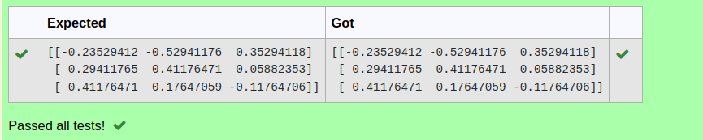

# INVERSE-OF-A-MATRIX
## Aim:
To write a python program to find the inverse of a matrix
## Equipment’s required:
1. 	Hardware – PCs
2. 	Anaconda – Python 3.7 Installation / Moodle-Code Runner
## Algorithm:
Step1 :
       Import numpy library using import statement.

Step 2:
      Using np.array(), create an array for the given matrix.

Step 3:
      Using the np.linalg.inv(), we can find the inverse of the given matrix.

Step 4:
       Print the result and end the program.

## Program:
```python

#Program to find the inverse of a matrix.
#Developed by:Aadithyan R
#RegisterNumber:22000618
import numpy as np
a=np.array([[1,0,3],[-1,2,-2],[2,3,-1]])
b=np.linalg.inv(a)
print(b)
```

## Output:

## Result:
Thus the inverse of given matrix is successfully solved using python program

